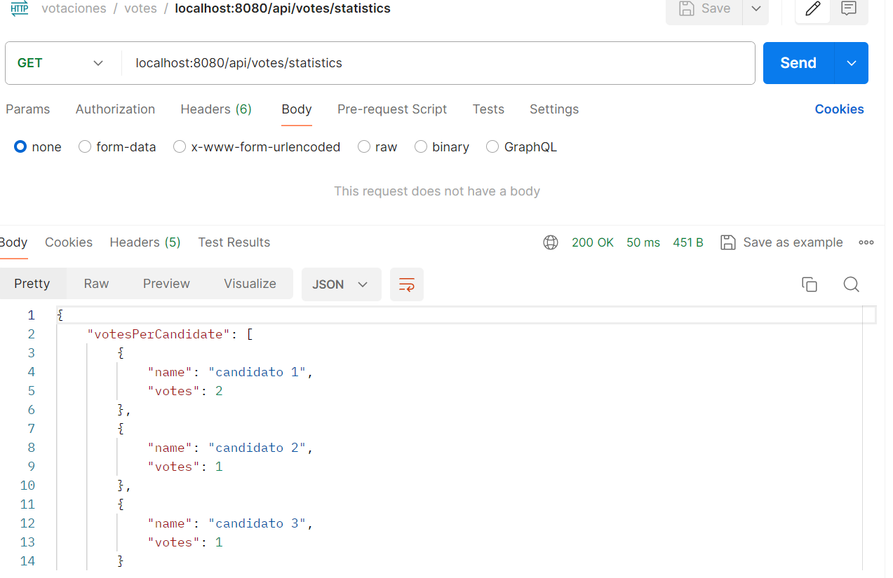
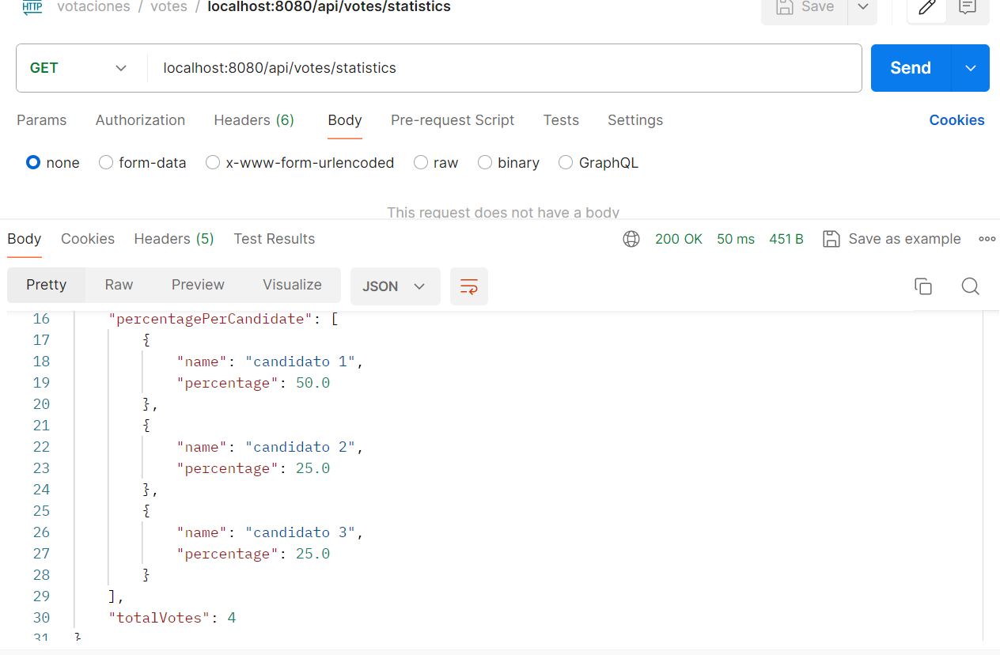

# ️ Sistema de Votaciones - API REST

Este proyecto es una API RESTful desarrollada como parte de una **prueba técnica** para la empresa **New Inntech**. El sistema permite gestionar **votantes**, **candidatos** y **votos**, incluyendo funcionalidades de estadísticas de votación, validaciones de roles cruzados y autenticación básica.

---

##  Tecnologías utilizadas

- Java 17
- Spring Boot 3
- Spring Security
- JPA + Hibernate
- MySQL
- Maven
- Swagger (OpenAPI 3)
- Lombok

---

## ️ Requisitos

Antes de ejecutar el proyecto, asegúrate de tener instalado:

- Java 17+
- Maven 3.8+
- MySQL workbench
- IDE como IntelliJ IDEA o VSCode

---

##  Configuración de base de datos

### 1. Crear la base de datos en MySQLL:


Puedes hacerlo ejecutando el siguiente script SQL o importando el archivo votaciones.sql ubicado en la carpeta db de la raiz :
```sql
-- db/schema.sql

CREATE DATABASE sistema_votaciones;
USE sistema_votaciones;

CREATE TABLE voter (
	id INT AUTO_INCREMENT PRIMARY KEY,
    name VARCHAR(100) NOT NULL,
    email VARCHAR(100) NOT NULL UNIQUE,
    has_voted BOOLEAN NOT NULL DEFAULT FALSE
);

CREATE TABLE candidate(
	candidate_id INT AUTO_INCREMENT PRIMARY KEY,
    candidate_name VARCHAR(100) NOT NULL,
    party VARCHAR(100),
    votes INT NOT NULL DEFAULT 0
);

CREATE TABLE vote(
	vote_id INT AUTO_INCREMENT PRIMARY KEY,
    voter_id INT NOT NULL,
    candidate_id INT NOT NULL,
    UNIQUE (voter_id),
    
    CONSTRAINT fk_vote_voter
        FOREIGN KEY (voter_id)
        REFERENCES voter(id)
        ON DELETE CASCADE,

    CONSTRAINT fk_vote_candidate
        FOREIGN KEY (candidate_id)
        REFERENCES candidate(candidate_id)
        ON DELETE CASCADE
);
```
### 2. Configurar application.properties
Asegúrate de tener tus credenciales de PostgreSQL correctas:
``` java
spring.datasource.url=jdbc:mysql://localhost:3306/sistema_votaciones?useSSL=false&serverTimezone=America/Bogota
spring.datasource.username=tu_usuario
spring.datasource.password=tu_contraseña

spring.datasource.driver-class-name=com.mysql.cj.jdbc.Driver
spring.jpa.hibernate.ddl-auto=none
spring.jpa.show-sql=true
spring.jpa.properties.hibernate.dialect=org.hibernate.dialect.MySQL8Dialect
``` 

## Como ejecutar el proyecto
**Clona el repositorio:**
https://github.com/Danielpuerta1013/sistema-votaciones.git
**Ejecuta el proyecto:**
mvn clean install
mvn spring-boot:run
**accede a swagger**
http://localhost:8080/api/swagger-ui/index.html

## Autenticación
La API utiliza autenticación básica HTTP (Basic Auth).
**Usuario:** admin
**Contraseña:** 1234

## Pruebas con postman
Se incluye una colección Postman con ejemplos de pruebas de todos los endpoints:
📁 Archivo: /postman/votaciones.postman_collection.json
¿Cómo usarla?
1. Abre Postman
2. Importa el archivo desde la carpeta postman

3. Actualiza la URL base si es necesario (por defecto: http://localhost:8080/api)

## 📬 Ejemplos de uso del API (con Postman)

> 🔐 **Autenticación requerida**  
> Todos los endpoints protegidos requieren autenticación básica:
> - **Usuario:** `admin`
> - **Contraseña:** `1234`

---

### 🔸 Crear un votante

**POST** `/api/voter`

```json
{
  "name": "usuario 1",
  "email": "usuario1@gmail.com"
}
```
respuesta:
respuesta:
```json
{
  "message": "El votante se ha creado correctamente"
}

```
### 🔸 Obtener votante por ID
**GET** `/api/voter?id=1`
respuesta:
```json
{
  "id": 1,
  "name": "usuario 1",
  "email": "usuario1@gmail.com",
  "hasVoted": false
}

```

### 🔸 Listar todos los votantes
**GET** `/api/voter/all`
respuesta:
```json
[
  {
    "id": 1,
    "name": "usuario 1",
    "email": "usuario1@gmail.com",
    "hasVoted": false
  },
  {
    "id": 2,
    "name": "usuario 2",
    "email": "usuario2@gmail.com",
    "hasVoted": false
  }
]
```


### 🔸 Eliminar votante por ID
**DELETE** `/api/voter?id=2`
respuesta:
```json
{
  "message": "El votante se ha eliminado correctamente"
}

```

### 🔸 Listar votantes con paginación y filtrado opcional por nombre y email
**GET** `/api/voter/paginated?page=0&size=10&name=usuario&email=usuario1@gmail.com`
respuesta:
```json
{
  "totalPages": 0,
  "totalElements": 0,
  "size": 0,
  "content": [
    {
      "id": 0,
      "name": "string",
      "email": "string",
      "hasVoted": true
    }
  ],
  "number": 0,
  "sort": {
    "empty": true,
    "sorted": true,
    "unsorted": true
  },
  "first": true,
  "last": true,
  "numberOfElements": 0,
  "pageable": {
    "offset": 0,
    "sort": {
      "empty": true,
      "sorted": true,
      "unsorted": true
    },
    "paged": true,
    "pageNumber": 0,
    "pageSize": 0,
    "unpaged": true
  },
  "empty": true
}
```

### 🔸 Crear un candidato
**POST** `/api/candidate`
```json
{
  "name": "candidato 1",
  "party": "Partido 1"
}
```
respuesta:
```json
{
  "message": "El candidato se ha creado correctamente"
}

```

### 🔸 Obtener candidato por ID
**GET** `/api/candidate?id=1`
respuesta:
```json
{
  "id": 1,
  "name": "candidato 1",
  "party": "Partido 1",
  "votes": 0
}
```

### 🔸 Listar todos los candidatos
**GET** `/api/candidate/all`
respuesta:
```json
[
  {
    "id": 1,
    "name": "candidato 1",
    "party": "Partido 1",
    "votes": 0
  },
  {
    "id": 2,
    "name": "candidato 2",
    "party": "Partido 2",
    "votes": 0
  }
]
```

### 🔸 Eliminar candidato por ID
**DELETE** `/api/candidate?id=2`
respuesta:
```json
{
  "message": "El candidato se ha eliminado correctamente"
}

```

### 🔸 Listar candidatos con paginación y filtrado opcional por nombre y party
**GET** `/api/candidate/paginated?page=0&size=10&name=candidato&party=Partido 1`
respuesta:
```json
{
  "totalPages": 0,
  "totalElements": 0,
  "size": 0,
  "content": [
    {
      "id": 0,
      "name": "string",
      "party": "string",
      "votes": 0
    }
  ],
  "number": 0,
  "sort": {
    "empty": true,
    "sorted": true,
    "unsorted": true
  },
  "first": true,
  "last": true,
  "numberOfElements": 0,
  "pageable": {
    "offset": 0,
    "sort": {
      "empty": true,
      "sorted": true,
      "unsorted": true
    },
    "paged": true,
    "pageNumber": 0,
    "pageSize": 0,
    "unpaged": true
  },
  "empty": true
}    

```

### 🔸 Registrar un voto
**POST** `/api/votes?voterId=1&candidateId=1`


respuesta:
```json
{
  "message": "El voto se ha creado correctamente"
}

```

### 🔸 Obtener todos los votos
**GET** `/api/votes`
respuesta:
```json
[
  {
    "voterName": "string",
    "candidateName": "string"
  }
]
```

### 🔸 Obtener estadísticas de votación
**GET** `/api/votes/statistics`
respuesta:
```json
{
  "votesPerCandidate": [
    {
      "name": "string",
      "votes": 0
    }
  ],
  "percentagePerCandidate": [
    {
      "name": "string",
      "percentage": 0.0
    }
  ],
  "totalVotes": 0
}
```
## Extra
- Validación cruzada entre votantes y candidatos un nombre no puede ser ambos, segu los parametros pedidos.
- Paginación y filtros por nombre para votantes y candidatos.Se deja en un endpoint aparte.
- Documentación con Swagger.
- Validaciones con @Valid y manejo de excepciones global.
-
## 🖼️ Captura de pantalla
Capturas de las estadisticas generadas



## Contacto
**Autor:** Daniel Puerta
**Contacto**+57 3103568928
